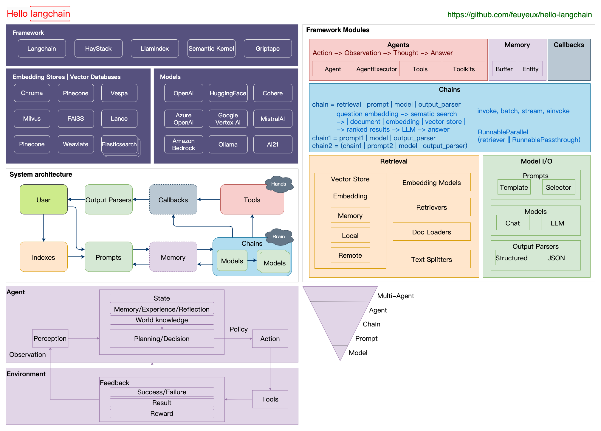

# hello-langchain



## Quick start

### python

```python
from langchain_core.prompts import ChatPromptTemplate
from langchain_openai import ChatOpenAI

prompt = ChatPromptTemplate.from_template(
    "你是顶级的短片作家，请根据{title}的内容，写一篇50字的精品短文，然后翻译成英文。"
)
llm = ChatOpenAI()
chain = prompt | llm
response = chain.invoke({"title": "窗外"})
print(response)
```

```sh
窗外是一片宁静的世界，阳光洒在绿树上，微风轻拂着花朵。草地上，孩子们欢笑嬉戏，快乐的声音传遍整个街区。鸟儿在天空中自由地飞翔，歌唱着美妙的旋律。这一切，让我感受到了生活的美好和希望。

Outside the window is a peaceful world, with sunlight streaming on the green trees and a gentle breeze caressing the flowers. On the grass, children laugh and play, their joyful voices echoing throughout the neighborhood. Birds soar freely in the sky, singing beautiful melodies. All of this makes me feel the beauty and hope of life.
```

### java

```java
@Slf4j
public class Hello {
    public static void main(String[] args) {
        Prompt prompt = PromptTemplate
                .from("你是顶级的短片作家，请根据{{title}}的内容，写一篇50字的精品短文，然后翻译成英文。")
                .apply(Map.of("title", "窗外"));
        ChatLanguageModel model = OpenAiChatModel.builder().apiKey(getKey()).build();
        String response = model.generate(prompt.text());
        log.info("{}", response);
    }
}
```

```sh
窗外，阳光洒在青翠欲滴的树叶上，微风轻拂着花朵般的云朵。小鸟欢快地歌唱着，似乎在述说着大自然的美妙。这一幕幕景象，如同一幅绚丽的画卷，勾勒出宁静与和谐的生活。窗外的世界，如此美好！

Outside the window, the sun shines on the lush green leaves, while a gentle breeze caresses the cloud-like blossoms. The birds sing joyfully, seemingly narrating the wonders of nature. These scenes, like a magnificent painting, depict a life of tranquility and harmony. The world outside the window is truly beautiful!
```

### rust

```rust
#[tokio::main]
async fn main() -> Result<()> {
    dotenvy::dotenv()?;
    let template =
        "你是顶级的短片作家，请根据{title}的内容，写一篇50字的精品短文，然后翻译成英文。"
            .to_string();
    let variables = vec!["title".to_string()];
    let mut args = PromptArgs::new();
    args.insert("title", "窗外");
    let prompt_template = PromptTemplate::new(template, variables, TemplateFormat::FString);
    let text = prompt_template.format(args)?;

    let openai = OpenAI::default();
    let result = openai.generate(&text).await?;
    print!("{:#?}", result.generation);
    Ok(())
}
```

```sh
窗外的世界充满了生机和活力。阳光洒在绿树上，微风轻拂着花朵。小鸟在天空中欢快地歌唱，给大地带来了春天的气息。这个美丽的景象让心情愉悦，仿佛世界都变得更加美好了。

The world outside the window is full of vitality and vigor. The sunlight sprinkles on the green trees, and the breeze gently brushes the flowers. Birds sing joy.
```

### go

## Reference

- [Introduction to LangChain](https://www.baeldung.com/java-langchain-basics)
- [Langchain4j github](https://github.com/langchain4j/langchain4j)
- [Langchain4j document](https://langchain4j.github.io/langchain4j/docs/tutorials)
- [LangChain github](https://github.com/langchain-ai/langchain)
- [LangChain JS github](https://github.com/langchain-ai/langchainjs)
- [LangChain JS document](https://js.langchain.com/docs/get_started/introduction)
- [LangChain Dart github](https://github.com/davidmigloz/langchain_dart)
- [LangChain Go github](https://github.com/tmc/langchaingo)
- [Gemini](https://ai.google.dev/tutorials/python_quickstart)
