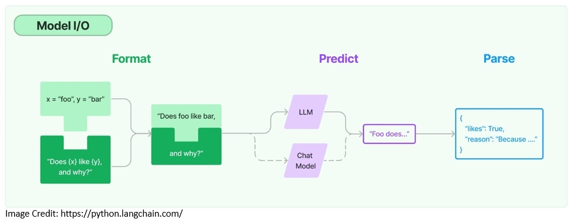

# Introduction to LangChain

> <https://www.baeldung.com/java-langchain-basics>
> Last updated: January 8, 2024

## 1. Introduction

In this tutorial, we’ll examine the details of [LangChain](https://www.langchain.com/), a framework for developing applications powered by language models. We’ll begin by gathering basic concepts around the language models that will help in this tutorial.

Although LangChain is primarily available in Python and JavaScript/TypeScript versions, there are options to use LangChain in Java. We’ll discuss the building blocks of LangChain as a framework and then proceed to experiment with them in Java.

## 2. Background

Before we go deeper into why we need a framework for building applications powered by language models, it’s imperative that we first understand what language models are. We’ll also cover some of the typical complexities encountered when working with language models.

### 2.1. Large Language Models

A language model is **a probabilistic model of a natural language** that can generate probabilities of a series of words. A [large language model](https://www.baeldung.com/cs/large-language-models) (LLM) is a language model characterized by its large size. They’re artificial neural networks with possibly billions of parameters.

An LLM is often **pre-trained on a vast amount of unlabeled data** using [self-supervised](https://en.wikipedia.org/wiki/Self-supervised_learning) and [semi-supervised learning](https://en.wikipedia.org/wiki/Weak_supervision) techniques. Then, the pre-trained model is adapted for specific tasks using various techniques like fine-tuning and prompt engineering:

[](https://www.baeldung.com/wp-content/uploads/2023/10/Large-Language-Model.jpg)

These LLMs are capable of performing several natural language processing tasks like language translation and content summarization. They’re also **capable of generative tasks like content creation**. Hence, they can be extremely valuable in applications like answering questions.

Almost all **major cloud service providers have included large language models** in their service offerings. For instance, [Microsoft Azure](https://azure.microsoft.com/en-us/solutions/ai) offers LLMs like Llama 2 and OpenAI GPT-4. [Amazon Bedrock](https://aws.amazon.com/bedrock/) offers models from AI21 Labs, Anthropic, Cohere, Meta, and Stability AI.

### 2.2. Prompt Engineering

LLMs are foundation models trained on a massive set of text data. Hence, they can capture the syntax and semantics inherent to human languages. However, they **must be adapted to perform specific tasks** that we want them to perform.

[Prompt engineering](https://en.wikipedia.org/wiki/Prompt_engineering) is one of the quickest ways to adapt an LLM. It’s a **process of structuring text that can be interpreted and understood by an LLM**. Here, we use natural language text to describe the task that we expect an LLM to perform:

[](https://www.baeldung.com/wp-content/uploads/2023/10/Prompt-Engineering.jpg)

The prompts we create help an LLM **perform [in-context learning](https://en.wikipedia.org/wiki/Prompt_engineering#In-context_learning), which is temporary**. We can use prompt engineering to promote the safe usage of LLMs and build new capabilities like augmenting LLMs with domain knowledge and external tools.

This is an active area of research, and new techniques keep surfacing now and then. However, techniques like **[chain-of-thought prompting](https://www.promptingguide.ai/techniques/cot) have already become quite popular**. The idea here is for the LLMs to solve a problem as a series of intermediate steps before giving a final answer.

### 2.3. Word Embeddings

As we’ve seen, LLMs are capable of processing a large volume of natural language text. The performance of LLMs vastly improves if we represent the words in natural languages as [word embeddings](https://en.wikipedia.org/wiki/Word_embedding). This is a **real-valued vector capable of encoding words’ meanings**.

Typically, the word embeddings are generated using an algorithm like [Tomáš Mikolov’s Word2vec](https://en.wikipedia.org/wiki/Word2vec) or [Stanford University’s GloVe](https://nlp.stanford.edu/projects/glove/). The **GloVe is an unsupervised learning algorithm** trained on aggregated global word-word co-occurrence statistics from a corpus:

[](https://www.baeldung.com/wp-content/uploads/2023/10/Word-Embedding-Illustration.jpg)

In prompt engineering, we convert the prompts into their word embeddings, allowing the model to understand better and respond to the prompt. Further, it’s also very **helpful in augmenting the context we provide to the model** allowing them to provide more contextual answers.

For instance, we can generate word embeddings from an existing dataset and store them in a vector database. Further, we can **use the user-provided input to perform a semantic search** into this vector database. Then we can use the search result as additional context to the model.

## 3. The LLM Tech Stack With LangChain

As we’ve seen already, **creating effective prompts is a key element** for successfully harnessing the power of LLMs in any application. This includes making the interaction with language models context-aware and being able to rely on a language model to reason.

For this, we’re required to perform **several tasks, like creating templates for prompts, making calls to language models, and providing user-specific data** from multiple sources to language models. To make these tasks simpler, we require a framework like LangChain as part of our LLM tech stack:


The framework also helps in developing applications that require chaining multiple language models and **being able to recall information about past interactions** with a language model. Then, there are more complex use cases that involve using a language model as a reasoning engine.

Finally, we can **perform logging, monitoring, streaming, and other essential tasks** for maintenance and troubleshooting. The LLM tech stack is evolving rapidly to address many of these concerns. However, LangChain is fast becoming a valuable part of LLM tech stacks.

## 4. LangChain for Java

[LangChain](https://www.langchain.com/) was **launched in 2022 as an open-source project** and soon gathered momentum through community support. It was originally developed by Harrison Chase in Python and soon turned out to be one of the fastest-growing start-ups in the AI space.

There was **a JavaScript/TypeScript version of LangChain that followed the Python version** in early 2023. It soon became quite popular and started supporting multiple JavaScript environments like Node.js, web browsers, CloudFlare workers, Vercel/Next.js, Deno, and Supabase Edge functions.

Unfortunately, there is **no official Java version of LangChain** that is available for Java/Spring applications. However, **there is a community version of LangChain for Java called [LangChain4j](https://github.com/langchain4j/langchain4j)**. It works with Java 8 or higher and supports Spring Boot 2 and 3.

The various dependencies of LangChain are [available at Maven Central](https://mvnrepository.com/artifact/dev.langchain4j/langchain4j/0.23.0). We may **need to add one or more dependencies** in our application, depending on the features we use:

```xml
<dependency>
    <groupId>dev.langchain4j</groupId>
    <artifactId>langchain4j</artifactId>
    <version>0.23.0</version>
</dependency>
```

For instance, we’ll also require the dependencies that [support integration to OpenAI models](https://mvnrepository.com/artifact/dev.langchain4j/langchain4j-open-ai/0.23.0), provide [support for embeddings](https://mvnrepository.com/artifact/dev.langchain4j/langchain4j-embeddings/0.23.0), and [a sentence-transformer model like all-MiniLM-L6-v2](https://mvnrepository.com/artifact/dev.langchain4j/langchain4j-embeddings-all-minilm-l6-v2-q/0.23.0) in the following sections of the tutorial.

With similar design goals to that of LangChain, LangChain4j **provides a simple and coherent layer of abstractions** along with its numerous implementations. It already supports several language model providers like OpenAI and embedding store providers like Pinecone.

However, since both **LangChain and LangChain4j are evolving quickly**, there may be features that are supported in the Python or JS/TS version that are not yet there in the Java version. Nevertheless, the fundamental concept, general structure, and vocabulary are largely the same.

## 5. Building Blocks of LangChain

LangChain offers several value propositions for our applications available as module components. Modular components provide useful abstractions along with a collection of implementations for working with language models. Let’s discuss some of these modules with examples in Java.

### 5.1. Models I/O

When working with any language model, we need the ability to interface with it. LangChain provides the necessary building blocks like the **ability to templatize prompts and to dynamically select and manage model inputs**. Also, we can use output parsers to extract information from model outputs:



Prompt templates are pre-defined recipes for generating prompts for language models and may include instructions, [few-shot examples](https://www.promptingguide.ai/techniques/fewshot), and specific context:

```java
PromptTemplate promptTemplate = PromptTemplate
  .from("Tell me a {{adjective}} joke about {{content}}..");
Map<String, Object> variables = new HashMap<>();
variables.put("adjective", "funny");
variables.put("content", "computers");
Prompt prompt = promptTemplate.apply(variables);
```

Here, we create a prompt template capable of accepting multiple variables. The variables are something we receive from the user input and feed to the prompt template.

LangChain supports integrating with two types of models, language models and chat models. Chat models are also backed by language models but provide chat capabilities:

```java
ChatLanguageModel model = OpenAiChatModel.builder()
  .apiKey(<OPENAI_API_KEY>)
  .modelName(GPT_3_5_TURBO)
  .temperature(0.3)
  .build();
String response = model.generate(prompt.text());
```

Here, we create a chat model with a particular OpenAI model and the associated API key. We can obtain an API key from [OpenAI](https://openai.com/) by registering for free. The parameter temperature is used to control the randomness of the model output.

Finally, the output from the language models may not be structured enough for presentation. LangChain provides **output parsers that help us structure language model responses** — for instance, extracting the information from the output as a POJO in Java.

### 5.2. Memory

Typically, an application leveraging a LLM has a conversational interface. An important aspect of any conversation is to be **able to refer to information introduced earlier in the conversation**. The ability to store information about past interactions is called memory:

[](https://www.baeldung.com/wp-content/uploads/2023/10/LangChain-Memory.jpg)

LangChain offers key enablers for adding memory to an application. For instance, we need the ability to read from the memory to augment the user input. Then, we need the ability to write the inputs and outputs of the current run to the memory:

```java
ChatMemory chatMemory = TokenWindowChatMemory
  .withMaxTokens(300, new OpenAiTokenizer(GPT_3_5_TURBO));
chatMemory.add(userMessage("Hello, my name is Kumar"));
AiMessage answer = model.generate(chatMemory.messages()).content();
System.out.println(answer.text()); // Hello Kumar! How can I assist you today?
chatMemory.add(answer);
chatMemory.add(userMessage("What is my name?"));
AiMessage answerWithName = model.generate(chatMemory.messages()).content();
System.out.println(answer.text()); // Your name is Kumar.
chatMemory.add(answerWithName);
```

Here, we implement a fixed window chat memory with *TokenWindowChatMemory*, which allows us to read and write chat messages that we exchange with the language model.

LangChain also offers **more complex data structures and algorithms to return selected messages** from the memory instead of returning everything. For instance, it has support for returning a summary of the past few messages, or only returning messages relevant to the current run.

### 5.3. Retrieval

Large language models are generally trained on a vast quantity of text corpus. Hence, they’re quite efficient in general tasks but may not be so useful in a domain-specific task. For this, we need to **retrieve relevant external data and pass it to the language model** during the generation step.

This process is known as the [Retrieval Augmented Generation (RAG)](https://www.promptingguide.ai/techniques/rag). It **helps in grounding the models on relevant and accurate information** as well as giving us insight into the model’s generative process. LangChain provides the necessary building blocks to create RAG applications:

[](https://www.baeldung.com/wp-content/uploads/2023/10/LangChain-Retrieval.jpg)

To begin with, LangChain provides document loaders that are used to retrieve a document from a storage location. Then, there are transformers available to prepare the documents for processing further. For instance, we can have it split a large document into smaller chunks:

```java
Document document = FileSystemDocumentLoader.loadDocument("simpson's_adventures.txt");
DocumentSplitter splitter = DocumentSplitters.recursive(100, 0, 
  new OpenAiTokenizer(GPT_3_5_TURBO));
List<TextSegment> segments = splitter.split(document);
```

Here, we’re using the *FileSystemDocumentLoader* to load a document from the file system. Then, we split that document into smaller chunks using *OpenAiTokenizer*.

To make the retrieval more efficient, the **documents are generally converted into their embeddings and stored in vector databases**. LangChain supports several embedding providers and methods and integrates with almost all popular vector stores:

```java
EmbeddingModel embeddingModel = new AllMiniLmL6V2EmbeddingModel();
List<Embedding> embeddings = embeddingModel.embedAll(segments).content();
EmbeddingStore<TextSegment> embeddingStore = new InMemoryEmbeddingStore<>();
embeddingStore.addAll(embeddings, segments);Copy
```

Here, we’re using the *AllMiniLmL6V2EmbeddingModel* to create the embeddings of document segments. Then, we store the embeddings in an in-memory vector store.

Now that we have our external data present in a vector store as embeddings, we’re ready to retrieve from it. LangChain supports several retrieval algorithms like simple semantic search and complex ones like ensemble retriever:

```java
String question = "Who is Simpson?";
//The assumption here is that the answer to this question is contained in the document we processed earlier.
Embedding questionEmbedding = embeddingModel.embed(question).content();
int maxResults = 3;
double minScore = 0.7;
List<EmbeddingMatch<TextSegment>> relevantEmbeddings = embeddingStore
  .findRelevant(questionEmbedding, maxResults, minScore);
```

We create the embedding of the user question and then use the question embedding to retrieve relevant matches from the vector store. Now, we can send the relevant matches retrieved as context by adding them to the prompt that we intend to send to the model.

## 6. Complex Applications of LangChain

So far, we’ve seen how to use individual components to create an application with a language model. LangChain also offers components to build more complex applications. For instance, we can use chains and agents to build more adaptive applications with enhanced capabilities.

### 6.1. Chains

Generally, an application will require **multiple components to be called in a specific sequence**. This is what’s referred to as a chain in LangChain. It simplifies developing more complex applications and makes it easier to debug, maintain, and improve.

This is also useful for **combining multiple chains to form more complex applications** that potentially require an interface with more than one language model. LangChain offers convenient ways to create such chains and provides many pre-built chains:

```java
ConversationalRetrievalChain chain = ConversationalRetrievalChain.builder()
  .chatLanguageModel(chatModel)
  .retriever(EmbeddingStoreRetriever.from(embeddingStore, embeddingModel))
  .chatMemory(MessageWindowChatMemory.withMaxMessages(10))
  .promptTemplate(PromptTemplate
    .from("Answer the following question to the best of your ability: {{question}}\n\nBase your answer on the following information:\n{{information}}"))
  .build();
```

Here, we’re using a pre-built chain *ConversationalRetreivalChain* that allows us to use a chat model together with a retriever along with memory and prompt template. Now, we can simply use the chain to execute user queries:

```java
String answer = chain.execute("Who is Simpson?");Copy
```

The chain comes with a default memory and prompt template that we can override. It’s also quite easy to create our custom chains. The ability to create chains makes it **easier to achieve modular implementation of complex applications**.

### 6.2. Agents

LangChain also offers more powerful constructs like agents. Unlike chains, **agents use a language model as a reasoning engine** to determine which actions to take and in which order. We can also provide agents access to the right tools to perform necessary actions.

In LangChain4j, **agents are available as AI Services** to declaratively define complex AI behavior. Let’s see if we can provide a calculator as a tool for an AI Service and enable a language model to perform calculations.

First, we’ll define a class with some basic calculator functions and describe each function in natural language for the model to understand:

```java
public class AIServiceWithCalculator {
    static class Calculator {
        @Tool("Calculates the length of a string")
        int stringLength(String s) {
            return s.length();
        }
        @Tool("Calculates the sum of two numbers")
        int add(int a, int b) {
            return a + b;
        }
    }
```

Then, we’ll define the interface for our AI Service to build from. It’s quite simple here, but it can also describe more complex behaviors:

```java
interface Assistant {
    String chat(String userMessage);
}
```

Now, we’ll build an AI Service from the builder factory provided by LangChain4j using the interface we just defined and the tool we created:

```java
Assistant assistant = AiServices.builder(Assistant.class)
  .chatLanguageModel(OpenAiChatModel.withApiKey(<OPENAI_API_KEY>))
  .tools(new Calculator())
  .chatMemory(MessageWindowChatMemory.withMaxMessages(10))
  .build();
```

That’s it! We can now start sending questions that contain some calculations to be performed to our language model:

```java
String question = "What is the sum of the numbers of letters in the words \"language\" and \"model\"?";
String answer = assistant.chat(question);
System.out.prtintln(answer); // The sum of the numbers of letters in the words "language" and "model" is 13. 
```

When we run this code, we’ll observe that the language model is now capable of performing calculations.

It’s important to note that **language models have difficulty performing some tasks** that require them to have the notion of time and space or perform complex arithmetic procedures. However, we can always supplement the model with the necessary tools to solve this problem.

## 7. Conclusion

In this tutorial, we went through some of the basic elements of creating an application powered by large language models. Further, we discussed the value of including a framework like LangChain as part of the tech stack for developing such an application.

This allowed us to explore some of the core elements of LangChain4j, a Java version of LangChain. These libraries will evolve rapidly in the days to come. But, they’re already making the process of developing applications powered by language models mature and fun!

Don’t forget to check out the full source code of this article [over on GitHub](https://github.com/eugenp/tutorials/tree/master/libraries-llms).
