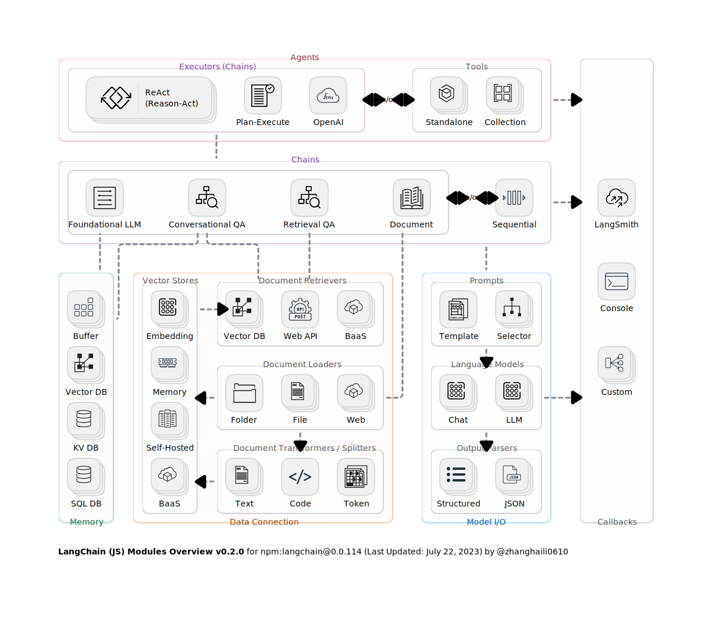

# Hello Langchain(Java)

## Quick start

```sh
mvn clean test -Dtest=Jdk21Test
```

```sh
# https://platform.openai.com/account/api-keys
export OPENAI_API_KEY={YOUR_OPENAI_API_KEY}

mvn test
```

```sh
[INFO] Running org.feuyeux.ai.langchain.hellolangchain.ModelsIOTest
01:20:49.159 [main] INFO org.feuyeux.ai.langchain.hellolangchain.ModelsIOTest - Why don't scientists trust atoms?

Because they make up everything!
[INFO] Tests run: 1, Failures: 0, Errors: 0, Skipped: 0, Time elapsed: 30.49 s -- in org.feuyeux.ai.langchain.hellolangchain.ModelsIOTest
```

```sh
[INFO] Running org.feuyeux.ai.langchain.hellolangchain.RetrievalTest
01:21:23.876 [main] INFO org.feuyeux.ai.langchain.hellolangchain.RetrievalTest - Based on the given information, Simpson is a cheerful carrot who lives in the town of VeggieVille. He is described as having vibrant orange skin and a lush green top. Simpson is known for his infectious laughter and warm personality. He is a part of a diverse group of friends, including Bella the beetroot, Timmy the tomato, and Percy the potato. They all share a close bond and have made a pact to always stand by each other.
[INFO] Tests run: 1, Failures: 0, Errors: 0, Skipped: 0, Time elapsed: 34.71 s -- in org.feuyeux.ai.langchain.hellolangchain.RetrievalTest
```

```sh
[INFO] Running org.feuyeux.ai.langchain.hellolangchain.ChainsTest
01:22:00.270 [main] INFO org.feuyeux.ai.langchain.hellolangchain.ChainsTest - Based on the given information, Simpson is a cheerful carrot who lived in the town of VeggieVille. He had a radiant and vibrant appearance with orange skin and a lush green top. Simpson was known for his infectious laughter and warm personality. He was part of a group that worked together as a team and celebrated victories with parties and games. Simpson valued friendship and made a pact with his friends to always support each other.
[INFO] Tests run: 1, Failures: 0, Errors: 0, Skipped: 0, Time elapsed: 36.39 s -- in org.feuyeux.ai.langchain.hellolangchain.ChainsTest
```

```sh
[INFO] Running org.feuyeux.ai.langchain.hellolangchain.MemoryTest
01:22:28.074 [main] INFO org.feuyeux.ai.langchain.hellolangchain.MemoryTest - Hello Kumar! How can I assist you today?
01:22:29.586 [main] INFO org.feuyeux.ai.langchain.hellolangchain.MemoryTest - Your name is Kumar.
[INFO] Tests run: 1, Failures: 0, Errors: 0, Skipped: 0, Time elapsed: 29.39 s -- in org.feuyeux.ai.langchain.hellolangchain.MemoryTest
```

```sh
[INFO] Running org.feuyeux.ai.langchain.hellolangchain.AgentsTest
01:22:58.061 [main] DEBUG dev.langchain4j.agent.tool.DefaultToolExecutor - About to execute ToolExecutionRequest { id = "call_P7iiDc5orL36Wr3WrWnX314Z", name = "stringLength", arguments = "{
  "arg0": "language"
}" } for memoryId default
01:22:58.072 [main] INFO org.feuyeux.ai.langchain.hellolangchain.AgentsTest - Calculating the length of "language"...
01:23:13.080 [main] DEBUG dev.langchain4j.agent.tool.DefaultToolExecutor - Tool execution result: 8
01:23:14.836 [main] DEBUG dev.langchain4j.agent.tool.DefaultToolExecutor - About to execute ToolExecutionRequest { id = "call_2WTf54JsUX1BS5tm1xfZPWcZ", name = "stringLength", arguments = "{
  "arg0": "model"
}" } for memoryId default
01:23:14.837 [main] INFO org.feuyeux.ai.langchain.hellolangchain.AgentsTest - Calculating the length of "model"...
01:23:29.839 [main] DEBUG dev.langchain4j.agent.tool.DefaultToolExecutor - Tool execution result: 5
01:23:31.845 [main] DEBUG dev.langchain4j.agent.tool.DefaultToolExecutor - About to execute ToolExecutionRequest { id = "call_vmLlSFvAFCx88HU45tWyhvSL", name = "add", arguments = "{
  "arg1": 8,
  "arg0": 5
}" } for memoryId default
01:23:31.851 [main] DEBUG dev.langchain4j.agent.tool.DefaultToolExecutor - Tool execution result: 13
01:23:33.721 [main] INFO org.feuyeux.ai.langchain.hellolangchain.AgentsTest - answer:The sum of the numbers of letters in the words "language" and "model" is 13.
[INFO] Tests run: 1, Failures: 0, Errors: 0, Skipped: 0, Time elapsed: 64.05 s -- in org.feuyeux.ai.langchain.hellolangchain.AgentsTest
```

## Langchain Modules



### Test Models I/O

```sh
mvn test -Dtest=ModelsIOTest
```

### Test Memory

```sh
mvn test -Dtest=MemoryTest
```

### Test Retrieval

```sh
mvn test -Dtest=RetrievalTest
```

### Test Chains

```sh
mvn test -Dtest=ChainsTest
```

### Test Agents

```sh
mvn test -Dtest=AgentsTest
```
